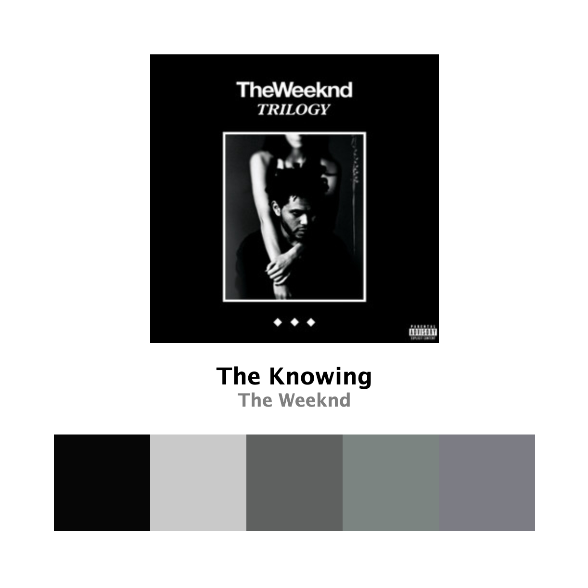
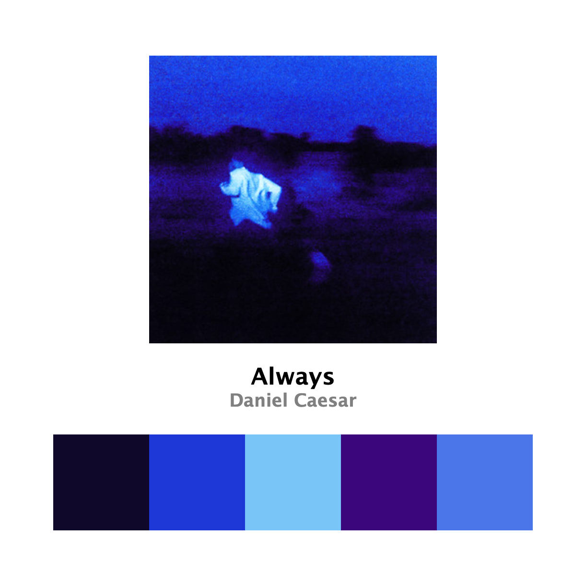
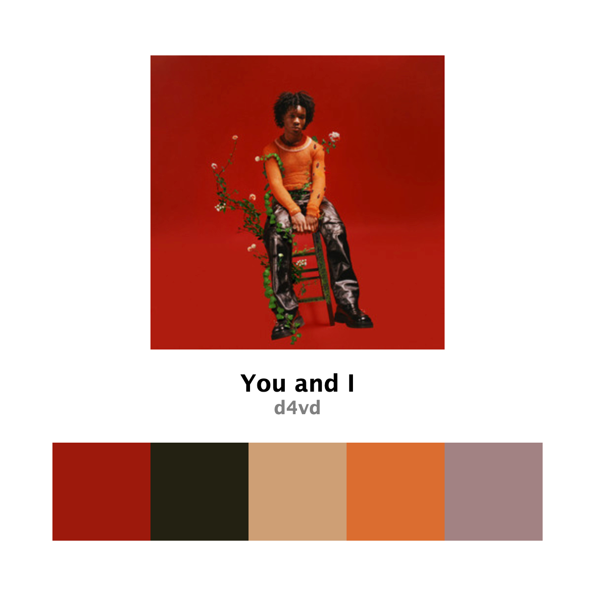

# MusicPalette

Gets a 5-color palette from the song cover and displays it on a webpage along with the song's name and artist(s).

  
  
  

### Credits
- [Spotipy API](https://spotipy.readthedocs.io/en/2.25.0/index.html#)
- [Color Thief Python API](https://github.com/fengsp/color-thief-py)
- [Flask API](https://flask.palletsprojects.com/en/stable/quickstart/#a-minimal-application)
